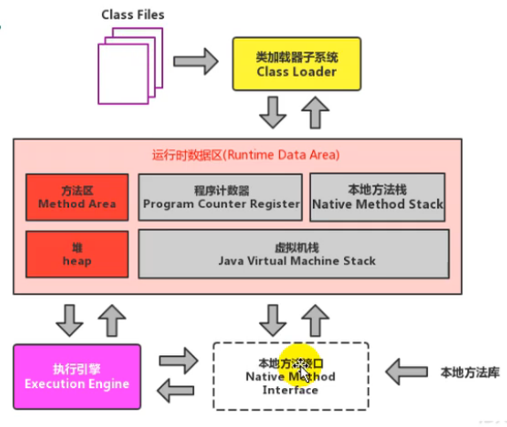

# 概述

[TOC]

- JVM面向字节码，进而使得其拥有一些有一些的features
  - 跨平台，平台无关
  - 跨语言，语言无关
  - 多语言混编，未来的方向

- 从整体的结构来看，整体分为，类装载模块，运行时区域，执行引擎（解释，编译，垃圾收集），本地方法模块
- 整体执行流程和结构相关，编译为字节码，加载到虚拟机中，后端编译（JIT或解释）
- JVM架构模型为栈模型，具备跨平台，指令集小，零指令等特点，但是整体指令数多，性能一般
- JVM生命周期很常规，分为启动、执行、退出
- JVM的发展，包括了前期的经典JVM，准确内存管理JVM，到现在三大商用JVM（Hotspot，JRocket，J9），还出现了各种各样的JVM，在历史上昙花一现；有的公司利用和硬件结合的方式，极限优化性能；微软谷歌在JVM上的故事；未来可能的新秀，Graal VM，Run Programs Faster Anyway
- JVM的学习将围绕着JVM内存结构展开……


​                                                                                                                                                                                                                                                                                                                                                                                                                                                                                   

# 简介

JVM是一种比Java更加成功的平台（编译器）。

**跨平台**


**跨语言**


**多语言混合编程**

## 特点

- 一次编译，到处运行
- 自动内存管理
- 自动垃圾回收功能

## 发展


# JVM的整体结构


- 执行引擎：主要负责翻译字节码未机器码，包括JIT，AOT等。

后续学习将从这里展开

# Java代码的执行流程


# JVM的架构模型


- 基于栈，实现简单，零指令，跨平台，指令集小，但是指令数多，性能差
- 基于寄存器，高效，依赖硬件，多级地址

通过编译可以直观感受到这样的例子。

对于栈式的结构：

````java
public class Main {
    public static void main(String[] args) {
        int i = 1;
        int j = 2;
        int k = i + j;
    }
}
// javap -v Main.class
...
...
  public static void main(java.lang.String[]);
    descriptor: ([Ljava/lang/String;)V
    flags: ACC_PUBLIC, ACC_STATIC
    Code:
      stack=2, locals=4, args_size=1
         0: iconst_1
         1: istore_1
         2: iconst_2
         3: istore_2
         4: iload_1
         5: iload_2
         6: iadd
         7: istore_3
         8: return
      LineNumberTable:
        line 3: 0
        line 4: 2
        line 5: 4 
        line 6: 8
      LocalVariableTable:
        Start  Length  Slot  Name   Signature
            0       9     0  args   [Ljava/lang/String;
            2       7     1     i   I
            4       5     2     j   I
            8       1     3     k   I
}
SourceFile: "Main.java"

````

寄存器的结构：

````assembly
move eax,2
add eax,3
````

# JVM的生命周期

- 启动，JVM规定由引导类加载器加载一个初始化类来完成，具体实现并未严格规范
- 执行，一个运行中的Java虚拟机有着一个清晰的任务:执行Java程序，程序开始执行时他才运行,程序结束时他就停止。执行一个所谓的Java程序的时候,真真正正在执行的是一个叫做Java虚拟机的进程
- 退出，正常执行结束或者调用JNI来退出


# JVM发展

- `Sun classic VM`，最早的虚拟机，只提供解释器，启用JIT需要外挂，而且无法配合使用。

- `Exact VM`，由于对象可能发生移动（垃圾回收中），引用对象实际上需要维护引用指向，这个时候需要回答这个对象究竟是是不是引用对象的问题，Exact VM提供了这种**准确式内存管理的功能**。此外，它具备一些**热点编译，混合模式的雏形**，只可惜被Hotspot替代了。

**三大商用虚拟机**


- `hotspot`，直到今天仍在使用。解释器其实注重程序响应时间，编译器实际上注重响应时间。


- `JRockit`，完全依靠即时编译器，放弃关注响应时间获得更快的运行时性能。值得一提的是，在JDK1.8的时候和hotspot做了整合。


- `J9虚拟机`，在IBM自己的应用中最快。

**高性能虚拟机**

与硬件深度耦合提高性能

- `Azul VM`，Systems公司做了大量针对硬件的改进
- `Liquid VM`，BEA公司
- TaobaoJVM
  - GCIH（GC invisible heap），off-heap，将生命周期较长的对象从heap中移到heap外，GC无法管理GCIH中的对象。
  - GCIH多虚拟进程共享对象
  - 针对大数据场景的ZenGC


**其他**

- KVM，Java ME时代使用的虚拟机
- Microsoft JVM，浏览器时代开发的虚拟机，后来sun被告，停止使用，催生了.net环境
- Dalvik VM虚拟机，没有遵循Java规范
  - 不能直接运行class文件，dex文件
  - 基于寄存器架构，不是jvm栈架构
  - AOT技术，跳过字节码，直接提前编译

**未来**


# JVM内存结构

简洁版。



详细版


- 其中加载模块和执行引擎模块需要重点关注