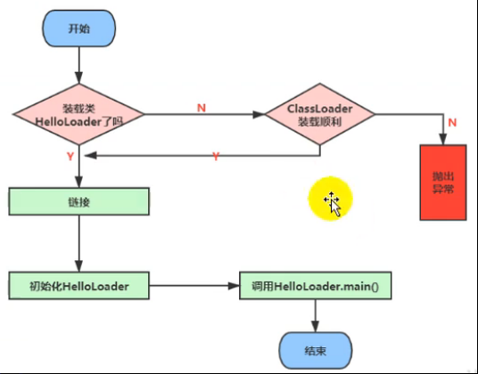
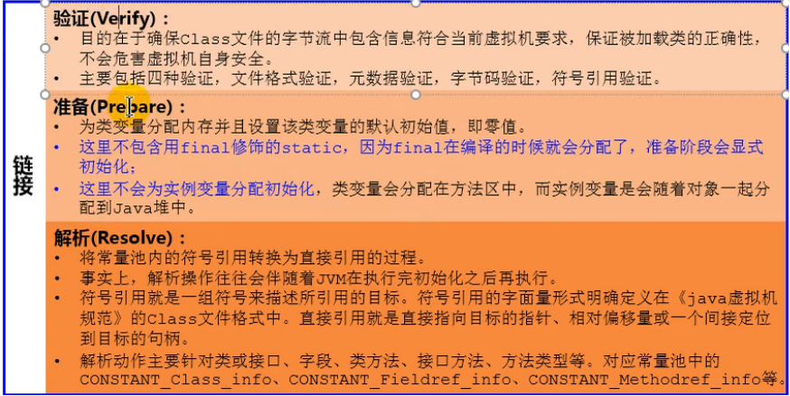
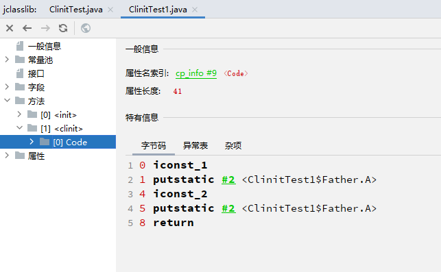

# 概述

- 类加载过程，重要的point如下
  - 静态初始化是在链接步骤中的准备阶段完成的，在这里会给类变量分配内存
  - 初始化阶段实际上是调用类初始方法`<clinit>`，针对静态变量，静态方法快初始化
    - 按顺序
    - 父类优先
    - 多线程安全

# 类加载过程

## 加载

1. 通过一个类的全限定名获取定义此类的二进制字节流
2. 将这个字节流所代表的静态存储结构转化为方法区的运行时数据结构
3. 在内存中生成一个代表这个类的java.lang.Class对象,作为方法区这个类的各种数据的访问入口

## 链接

链接包含三步，注意准备过程，实际是会为类变量（静态变量）分配内存，默认初始零值。

注意final static声明的不会在这里初始化，因为常量在编译过程中已经确定的。

- 验证，验证class文件的合法性
- 准备，类变量分配内存，初始化零值
- 解析，符号引用转为直接引用

## 初始化

初始化实际上是执行类构造器方法`<clinit>`的方法的过程，该方法会收集静态赋值和静态语句块，按顺序执行。

注意要点：

- 按顺序执行，见 [ClassInitTest.java](..\chapter02\src\main\java\ClassInitTest.java) 
- `<clinit>`不是对象的构造器，而是专门用于静态语句（块）的构造器，见 [ClinitTest.java](..\chapter02\src\main\java\ClinitTest.java) 
- 子类的`<clinit>`执行前父类的`<clinit>`会执行，见代码3 [ClinitTest1.java](..\chapter02\src\main\java\ClinitTest1.java) 
- 虚拟机保证`<clinit>`在多线程环境下执行自动加锁，见代码4 [DeadThreadTest.java](..\chapter02\src\main\java\DeadThreadTest.java) 

利用jclasslib插件可以查看反编译后的底层指令，例如各种顺序问题的底层指令执行。

# 类加载器

一般常见的有三个：

- Bootstrap ClassLoader，c++编写，Java中无法获取其类对象，加载Java核心类
- ExtClassLoader，加载jre/lib/ext的类
- AppClassLoader，一般的应用类都是其加载的，使用ClassLoader.getSystemClassLoader可以获取到该类加载器。

但在JVM标准中，其实只划分为两大类，一类的引导类加载器，另一类是自定义类加载器，上述三个中的后两者都是继承自ClassLoader类，属于自定义加载器。

此外需要注意它们之间虽然可以用getParent（app->ext->boostrap）获取到父加载器，但实际上并不是继承关系，而是包含关系。

**细节**

1. JVM表示两个class对象是否为同一个类的两个必要条件，类的完整名必须一致，包括包名，其次类加载器必须一样
2. 如果某个类不是由启动加载器加载，那么它会将这个类加载器的引用作为该类类型信息的一部分保存在方法区。这很自然，JVM需要直到一个类的信息包括其加载器的信息。

## 自定义类加载器

自定义类加载器需要了解两方面的问题。

**为什么需要自定义类加载器？**

- 隔离加载类，可能不同框架会出现包名相同的情况，这时候使用不同的类加载器可以隔离这种情况
- 修改类加载的方式，如果类本身是加密的，可以通过自定义加载器的方式来使用加密的类，从而保证源码不被泄露
- 拓展加载源

**自定义加载器的基本方式**

 [CustomClassLoader.java](..\chapter02\src\main\java\classloader\CustomClassLoader.java) 

- 继承抽象类`Java.lang.ClassLoader`
- 实现`findClass`方法
  - 该方法需要以二进制的方式加载类的二进制流
  - 调用``defineClass`方法加载二进制流
- 如果需求简单，可以直接继承`URLClassLoader`类=

## 双亲委派机制

> custom - >app->ext->boostrap

类加载的时候并不是上来就加载，而是先委托给父加载器进行加载，递归进行，如果父加载器加载不了，才交给子加载器。此处加载不了，指的是，例如，ext会去看现在的包名是否是它自己需要负责的包。

**好处**

- 避免类的重复加载，最终都会委托到顶层，从上到下加载，加载过的就不再加载

- 避免核心API被篡改

  - java.lang.String，例如自定义这种类，委托到顶层加载器，只会加载到原来的核心类，既然无法被加载，它的代码也无法被执行
  - java.lang.Custom，同理，这种类也无法被加载，Java规定了核心的包内，只有原本的类才会被加载

  

