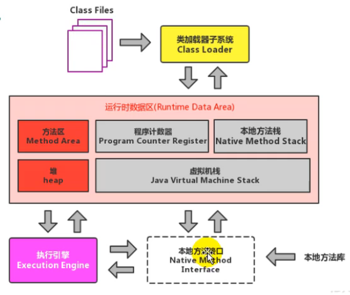
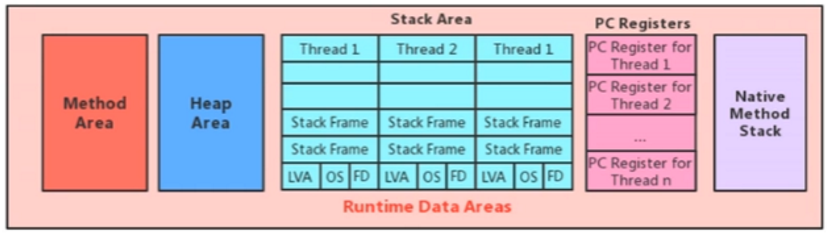
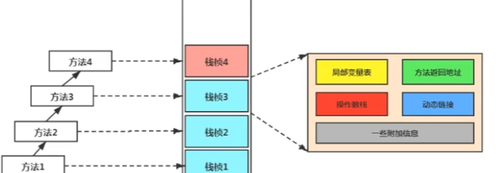
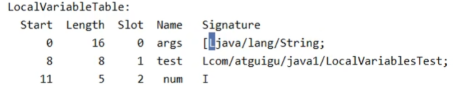
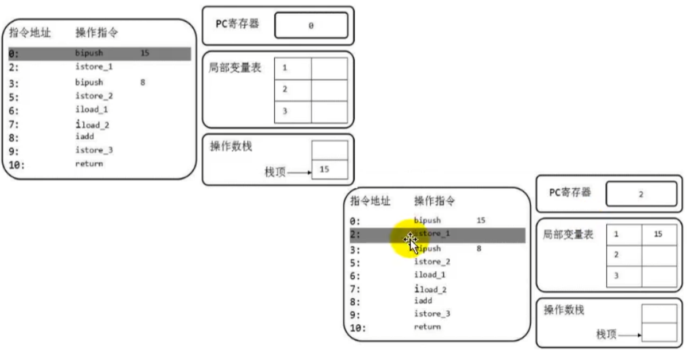

# 整体结构




注意运行时数据区，红色部分是线程共享的，灰色是线程独占的。注意，整个属于JVM，每个进程一份。

详细版



# 程序计数器

也叫PC寄存器，它是利用内存对物理寄存器的一种抽象模拟，如果了解CPU中的寄存器，这个东西就非常好理解了——你很容易想象为什么每个线程需要一份。

注意：PC寄存器是虚拟机规范中没有规定任何OOM的区域，本质上其实是因为它的占用的空间非常小，几乎可以忽略不记，比起和它配套的内存来说。

# 虚拟机栈

栈，基本单位为栈帧。通过`-Xss255k`可以指定大小。

栈帧里包含：



## 局部变量表

**基本设计**

每个方法都有一个局部变量表，所需的容量在编译过程中被确定下来。局部变量表中一个slot为32位，双精度类型占两个slot，需要注意的是，char，short，boolean也将占用一个slot。非静态方法在局部变量表的最开始会记录this变量，指向对象本身。

**

**局部变量表与垃圾回收**

局部变量表是虚拟机栈中与性能调优关系最为密切的部分，原因在于局部变量的引用将影响堆的垃圾回收。那么很自然地，局部变量表适合作为GC Root。方法被回收，则会使大量的局部变量失去引用，从这个角度，非常好理解为什么JVM是标记存活的对象。

## 操作数栈

处理局部变量表之外，我们程序中经常需要一些计算，这就需要一个临时的操作数栈来保存结果。

事实上，即使是简单的赋值操作也需要操作数栈，我们先来体会它的是什么。记住操作数栈是栈中栈。

### 直观理解

简单的程序，实际上发生的事情如下。

```java
int i = 15;
int j = 8;
int k = i + j;
```



首先需要push一个15到操作数栈中，b指的是byte类型，因为15的范围byte可以存。然后push进去之后，实际上我们要把它视为int存进局部变量表的slot中。于是调用`istrore_1`，其中i表示int，1表示局部变量表索引为1 。在这个过程中，能够清晰体会的操作数栈的作用。

其中`push`和`load`都是操作操作数栈的，`store`则是保存到局部变量表中。

### 操作数栈

不理解操作数栈就无法理解字节码指令，实际上字节码最终还需要被执行引擎翻译为机器码，CPU才能认识。

操作数栈的深度同样在编译过程中就可以被确定的，这比较有意思。

此外，如果被调用的方法带有返回值的话，那么其返回值将会被压入当前栈帧中，例如：

````JAVA
public int getSum() {
    int i = 5;
    int j = 3;
    int k = i + j;
    return k;
}

public void testGetSum() {
    int j = 10;
    int i = getSum();
}
// 字节码如下
// 操作数栈中压入10
0 bipush 10
// 保存到局部变量表索引1
2 istore_1
// 将局部变量表0位置上的this加载到操作数栈中
3 aload_0
// 调用另一个函数
4 invokevirtual #2 <TestOperationStack.getSum>
// 将结果保存到局部变量表2的位置
7 istore_2
8 return
````

## 栈顶缓存技术

由于基于栈的设计结构，指令多，内存操作多，因而提出了这种借用物理寄存器的缓存技术。

## 动态链接

动态链接包含两点：

- 每一栈帧都保存一个指向运行常量池的引用，该指针指向该栈帧的方法的常量池部分
- Java字节码中所有遍历和方法都表示为符号引用

先来看是什么，再谈谈理解。

````java
// 方法
public void testGetSum() {
    int j = 10;
    int i = getSum();
}
// 字节码
0: bipush        10
2: istore_1
3: aload_0
4: invokevirtual #5    // Method getSum:()I
7: istore_2
8: return
// 注意到#5即为符号引用，来看常量池
Constant pool:
#2 = Class              #42            // TestOperandStack
#5 = Methodref          #2.#44         // TestOperandStack.getSum:()I
#20 = Utf8               getSum
#21 = Utf8               ()I
#44 = NameAndType        #20:#21        // getSum:()I
````

因为这些信息的长度是不固定的，很自然地考虑用常量池的形式进行编码。那就非常好理解了。

- 为何要用符号引用？原因如上所述。
- 为何每个栈帧要保存指向运行常量池的引用？可以类比对象和引用的关系，放在常量池里可以共享，多个引用可以同时引用该方法的信息。

**另外一点比较重要，常量池指的是字节码中的常量池，在加载过程中会被放到方法区中，变为运行时常量池。**

https://www.bilibili.com/video/BV1PJ411n7xZ?p=56

## 方法调用

### 方法的动态链接（后期绑定）和静态链接（早期绑定）

- 方法静态绑定指方法在编译期间就能够确定
- 动态绑定则指的是方法可以在运行期间被动态改变

这也是实现多态的基础。

值得一提的是，**Java中所有普通方法都是虚方法，这一点可以通过编译class文件看到。**虚方法即可以在运行期间进行绑定，换句话说，普通方法都具备多态的特性，父类可以调用子类的实现。——这很好理解，在Java中，方法是可以被重写的。

### 虚方法

- 静态方法

- 私有方法

- final方法

- 实例构造器

- 父类方法

**对应的指令**：

-  invokestatic，静态方法，编译时确定
- invokespecial，编译时确定

- invokeinterface，接口方法，运行时确定
- invokevirtual，虚方法，运行时确定。注意，若调用父类的方法，实际也是编译时确定。

[Son.java](..\chapter05\src\main\java\Son.java) 

### `invokedynamic`和动态类型语言

**静态类型语言和动态类型语言**，区别是类型检查是在编译时期或是运行时期完成。

Java是一种强类型的语言，JDK8之后，函数式接口的加入（匿名实现），使它具备一定的动态类型语言的特性。

例如`var a = ?`，动态类型语言的特点就是，变量的类型无法根据变量本身来确定，而需要值来确定。

```java
public class TestInvokeDy {
    public static void main(String[] args) {
        // invokespecial 因为调用的就是该类的构造方法
        FuncIn a = new FuncInImpl();
        // invokedynamic，声明类型，但实际上不知道具体值的类型
        FuncIn b = () -> {
            System.out.println("lambda impl");
        };
        // invokespecial ??
        FuncIn c = new FuncIn() {
            @Override
            public void fun() {
                System.out.println("匿名");
            }
        };
        a.fun();
        b.fun();
    }
}

class FuncInImpl implements FuncIn {

    @Override
    public void fun() {
        System.out.println("impl");
    }
}

interface FuncIn{
    void fun();
}
```

